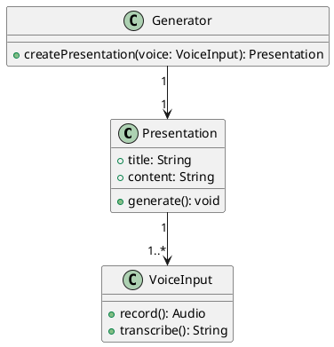
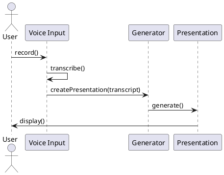
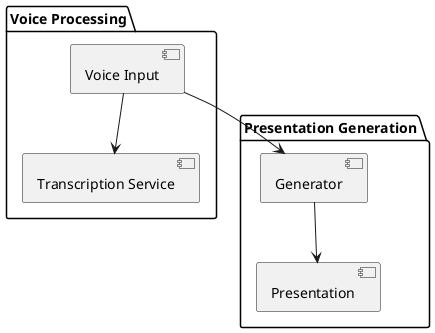
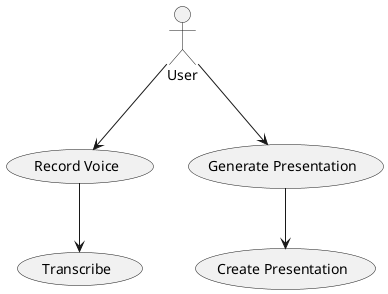
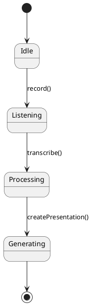
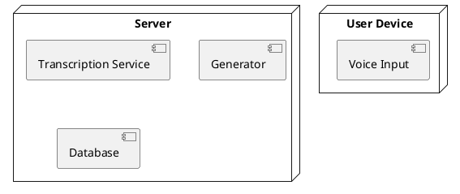
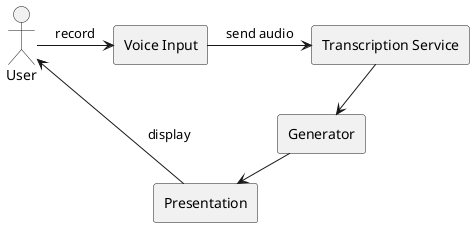

# UML Diagrams for Arabic Voice-to-Presentation Generator

## Class Diagrams

## Sequence Diagrams

## Component Diagrams

## Use Case Diagrams

## State Diagrams

## Deployment Diagrams

## Data Flow Diagrams

